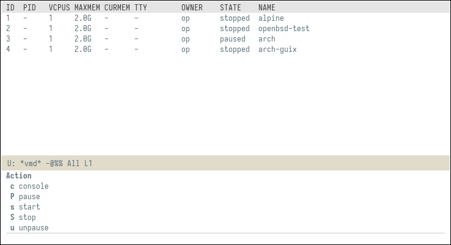

# vmd.el

vmd is an Emacs package to interact with [OpenBSD' vmd][vmd].



In a `*vmd*` buffer (opened with `M-x vmd RET`), the following keys
are defined:

 - `c`: (console) open a terminal connected to the vm at point
 - `P`: pause the vm at point
 - `s`: start the vm at point
 - `S`: stop the vm at point
 - `u`: unpause the vm at point

additionally, `x` will bring up a transient popup with the mnemonics
for the keys.


### Customize the terminal for the console

To use vterm (or any other packages really) to handle a shell for the
console, `vmd-console-function` must point to a function that accepts
two parameters, name and cmd, and execute cmd (a list of strings) in
your preferred terminal.  By default, `ansi-term` (bundled with Emacs)
is used, so it's easy to switch e.g. to vterm:

```elisp
(defun my/vmd-vterm (name cmd)
  (let ((vterm-shell (mapconcat #'shell-quote-argument cmd " "))
        (vterm-buffer-name (concat "*" name "*")))
    (vterm)))
(setq vmd-console-function #'my/vmd-vterm)
```


[vmd]: http://man.openbsd.org/vmd
